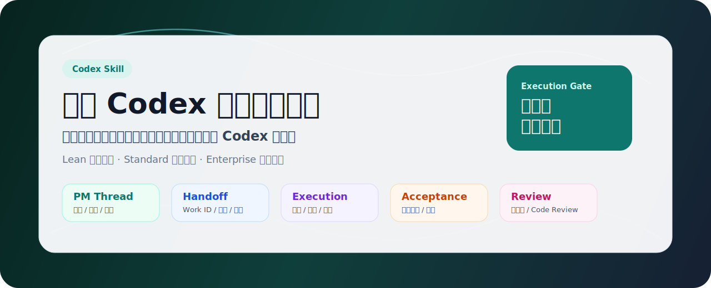
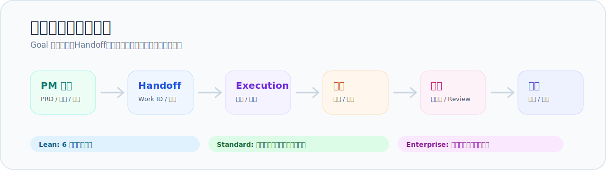

# 橙影 · Codex 企业级工作流 Skill Pack

<p align="center">
  
</p>

<p align="center">
  
  
  
  
</p>

面向 Codex 的对话式软件项目协作工作流 Skill Pack。它把粗略想法、半成型需求、已有 PRD / 设计稿 / 代码仓库，整理成可开发、可验收、可交接的 Codex 工作单。

> 先像真实软件团队一样把项目想清楚，再让 Codex 写代码。

## 一眼看懂

| 项目 | 说明 |
| --- | --- |
| 它是什么 | Codex 软件项目的 PM、Handoff、Execution、验收和审查工作流 |
| 适合谁 | 想让 Codex 做小工具、网站、App、SaaS、后台、企业系统或长期商业项目的人 |
| 解决什么 | 防止 Codex 一句话开干、PM 自己改代码、Goal 出太早、验收不严格、需求和实现断链 |
| 如何分流 | Lean 快速做小任务，Standard 稳定做正式项目，Enterprise 管长期和高风险项目 |
| 核心边界 | PM Thread 负责对齐和派发；Level 2/3 必须交给 Execution Thread 开发 |

## 核心能力

| 能力 | 结果 |
| --- | --- |
| PM 对齐 | 把想法收敛成 PRD、非目标、设计依据、技术边界和验收标准 |
| 开发前确认 | 用状态表、事实分层、确认台和精简 Handoff 降低反复沟通成本 |
| 受控执行 | Goal 授权后再进入 Execution，按阶段计划开发、测试和修复 |
| 严格验收 | Phase Acceptance、需求一致性审核、Code Review、截图和阻塞验证分层把关 |
| 文档沉淀 | 将项目事实、Work ID、Handoff、QA、反馈和版本结果写入 `docs/codex/` |
| 风险升级 | 登录、权限、API Key、Token、部署、自动化、外部数据源等自动升级 Standard / Enterprise |

<p align="center">
  
</p>

## 适用场景

- 小程序、H5、官网、活动页
- Web App、SaaS、后台管理系统
- iOS / Android / 跨端 App
- 企业内部系统、CRM、订单系统、内容系统
- 工具软件、AI 工具、自动化工具
- 基于开源项目的二次开发
- 需要长期维护、多人协作、阶段性交付的商业项目

## 流程档位

| 档位 | 适用 | 输出方式 |
| --- | --- | --- |
| Lean | 小工具、Demo、单页、小改动 | 只保留目标、非目标、允许修改、禁止修改、验收方式和回滚方式 |
| Standard | 正式网站、App、后台、中小型 SaaS | 默认压缩输出，保留 PRD、设计、TECH_SPEC、PHASE_PLAN、VALIDATION、Handoff 和验收门禁 |
| Enterprise | 长期商业项目、用户数据、权限、上传、计费、发布、多线程 | 完整文档体系、ADR、架构影响面、多线程治理、审查、隐私审计和发布文档 |

默认映射：Level 1 -> Lean，Level 2 -> Standard，Level 3 -> Enterprise。涉及登录、权限、上传、支付、客户数据、schema/API、发布或商用交付时必须升级流程档位。

## 线程职责

| 线程 | 负责 | 不负责 |
| --- | --- | --- |
| PM Thread | 需求、范围、风险、计划、验收标准、Handoff、Goal 授权前准备 | Level 2/3 项目中直接改代码 |
| Execution Thread | 按 Work ID 和 Handoff 做阶段开发、测试、修复 | 自己扩范围、自我验收 |
| Phase Acceptance Thread | 对照阶段计划和证据验收，必要时生成 Fix Request | 替执行线程修代码 |
| Code Review / Release Thread | 审查、安全、隐私、发布和版本关闭 | 新增业务需求 |

如果环境没有线程工具，PM Thread 只能输出可复制的 Execution Thread 任务包，并停在 `blocked_waiting_for_execution_thread`，等待用户新开或指定执行线程。

## 安装

推荐安装到 Codex skills 目录：

```bash
mkdir -p ~/.codex/skills
git clone https://github.com/btcys/chengying-codex-skill-pack.git ~/.codex/skills/chengying-codex-enterprise-skill
```

目录中必须包含：

```text
SKILL.md
AGENTS.md
README.md
references/
assets/templates/
```

安装后重启 Codex，或开启新的 Codex 对话，让 Skill 列表重新加载。

## 更新

如果是用 `git clone` 安装的：

```bash
cd ~/.codex/skills/chengying-codex-enterprise-skill
git pull
```

如果是手动复制安装的，用新版本覆盖同名目录即可。覆盖前建议保留自己改过的 `SKILL.md` 或 `AGENTS.md`。

## 快速开始

安装后，对 Codex 说：

```text
启动橙影 Codex 企业级工作流，先 PM 访谈，不要直接开发。
```

也可以直接描述项目：

```text
用橙影工作流帮我做一个会员管理小程序，先梳理需求，再决定怎么开发。
```

```text
按橙影 Codex 企业级工作流，从 0 规划一个 SaaS 项目，先输出 PM 交接包。
```

```text
这个项目准备长期维护，先建立 PM 线程、项目文档和任务拆解，不要直接写代码。
```

## 推荐用法

### 1. 先开 PM Thread

```text
启动橙影 Codex 企业级工作流。
这是一个面向门店的会员管理小程序，请先作为 PM Thread 访谈我，不要写代码。
```

PM Thread 会先确认项目目标、用户、MVP、非目标、设计依据、技术边界、风险、阶段计划和验证方式。

### 2. 再整理开发前对齐包

```text
请整理开发前对齐包 / PM Handoff 草案。先输出当前阶段、已确认、我的建议、待确认、缺口和下一步；不要直接生成最终 Goal。
```

正式开发前应至少明确 Work ID、目标线程、修改范围、禁止范围、阶段版本、验收方式、必须运行的验证、回滚方式和 Goal 就绪判断。

### 3. 最后进入 Execution Thread

```text
当前已切换到 Execution Thread。
请严格基于下面 Work ID 和 PM Handoff 工作单执行，只做当前 Task，不做无关优化。

[粘贴 PM Handoff 工作单或 Lean 等价工作单]
```

Execution Thread 完成后必须输出修改文件、完成内容、测试结果、风险、回滚方式和下一步建议。

## 开发前确认台

当 PRD、设计、技术方案、阶段计划、验收方案或 Handoff 需要用户逐项确认时，可使用：

```text
assets/templates/confirmation-board/project-confirmation-board.html
```

确认台只用于开发前确认，不展示开发进度，不替代正式文档，也不替代最终 Goal Prompt。用户确认、采纳、拒绝和补充意见后，Codex 应同步回 PRD / TECH_SPEC / PHASE_PLAN / VALIDATION / Handoff。

## 推荐项目目录

真实项目建议把治理文档放到 `docs/codex/`。PM 阶段只建立项目管理文档区，不提前创建源码目录；已有项目不得直接覆盖 `README.md`、`CHANGELOG.md`、`AGENTS.md`。

模板在 [`assets/templates/docs-codex/`](assets/templates/docs-codex/) 和 [`assets/templates/project-root/`](assets/templates/project-root/)。

## 详细规则

README 只保留入口说明。完整流程规则请看：

| 文件 | 内容 |
| --- | --- |
| [`SKILL.md`](SKILL.md) | Skill 触发入口和核心工作流 |
| [`AGENTS.md`](AGENTS.md) | 面向 Codex 的协作和执行约束 |
| [`references/process-modes.md`](references/process-modes.md) | Lean / Standard / Enterprise 档位规则 |
| [`references/pm-thread.md`](references/pm-thread.md) | PM Thread 访谈、状态表和对齐规则 |
| [`references/prd-design-plan.md`](references/prd-design-plan.md) | PRD、产品原型、设计规范和阶段计划 |
| [`references/technical-spec.md`](references/technical-spec.md) | TECH_SPEC / ADR 和技术边界 |
| [`references/validation-strategy.md`](references/validation-strategy.md) | VALIDATION、QA 矩阵和阻塞验证 |
| [`references/execution-contract.md`](references/execution-contract.md) | Execution Thread、自动开发和修复约束 |
| [`references/phase-acceptance.md`](references/phase-acceptance.md) | 阶段验收、Fix Request 和复验 |
| [`references/requirement-compliance.md`](references/requirement-compliance.md) | 需求一致性审核 |
| [`references/release-review-evolution.md`](references/release-review-evolution.md) | Code Review、隐私审计、发布和反馈进化 |
| [`references/confirmation-board.md`](references/confirmation-board.md) | 项目开发前确认台使用说明 |

## 常用提示词

PM 启动：

```text
启动橙影 Codex 企业级工作流。请作为 PM Thread，先逼问出完整 PRD、设计依据、技术边界和验收标准，不要写代码。
```

流程检查：

```text
请按橙影工作流输出当前阶段、已有产物、缺口、风险和下一步；门禁不通过的阶段不要继续推进。
```

准备开发：

```text
用户已确认按 Goal 执行。请先登记 Work ID，然后基于已确认的开发前对齐包 / PM Handoff 工作单，生成适合 Execution Thread 使用的任务说明。
```

阶段验收：

```text
当前是 Phase Acceptance Thread。请只验收当前 Work ID 是否严格完成 PHASE_PLAN 或 Lean 轻量任务单里的计划项；不合格生成 Fix Request，不要替它修代码。
```

反馈进化：

```text
用户反馈了一个流程/执行问题：请先记录到 FEEDBACK_LOG.md；如果这是重复问题或导致返工，请判断应该升级到哪个检查项或规则文档。
```
