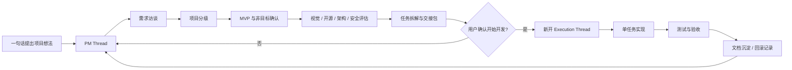
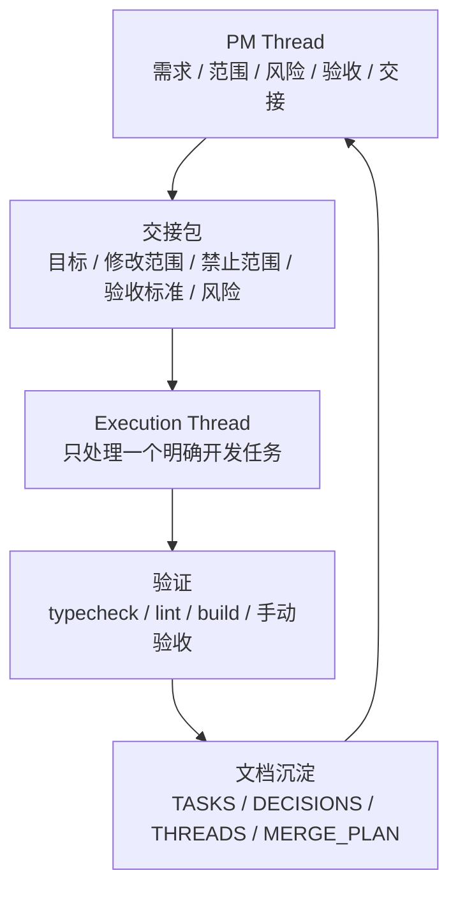
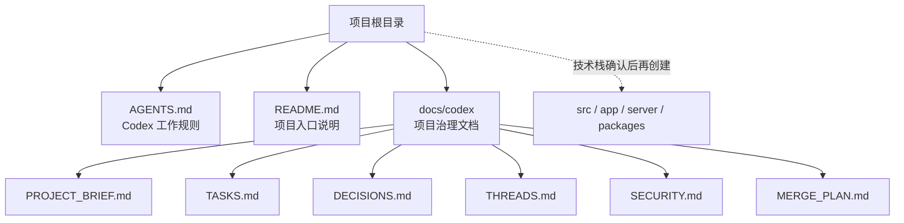

# 橙影 · Codex 企业级工作流 Skill Pack

一句话启动 Codex 软件项目开发的企业级工作流 Skill Pack。

它适合把一个“我想做个小程序 / 网站 / App / SaaS / 后台系统 / 工具软件”的模糊想法，先交给 Codex 做 PM 访谈、范围确认、任务拆解、风险评估和交接包整理；等用户确认后，再切换到新的 Execution Thread 进入代码实现。

核心原则很简单：先像真实软件团队一样把项目想清楚，再让 Codex 写代码。

## 能解决什么

- 避免 Codex 一上来就建项目、写代码、选技术栈。
- 把 PM Thread 和 Execution Thread 分开，PM 线程不改代码。
- 让开发前必须明确 MVP、非目标、验收标准、修改范围和禁止修改范围。
- 适配轻量 Demo、正式产品、长期商业项目三种复杂度。
- 为长期项目沉淀 `docs/codex/` 文档，降低聊天上下文丢失带来的风险。
- 规范多线程开发：长期线程服务长期主线，临时线程完成后必须合并、放弃或归档。

## 适用项目

- 小程序、H5、官网、活动页
- Web App、SaaS、后台管理系统
- iOS / Android / 跨端 App
- 企业内部系统、CRM、订单系统、内容系统
- 工具软件、AI 工具、自动化工具
- 基于开源项目的二次开发
- 需要长期维护、多人协作、阶段性交付的商业项目

## 工作流总览



## 线程职责图



PM Thread 只负责梳理、判断、确认和交接，不负责代码修改。真正开始开发时，应新开 Execution Thread，并把 PM Thread 的交接包作为执行输入。

## 安装

推荐安装到 Codex skills 目录：

```bash
mkdir -p ~/.codex/skills
git clone https://github.com/btcys/chengying-codex-skill-pack.git ~/.codex/skills/chengying-codex-enterprise-skill
```

目录中必须包含：

```text
SKILL.md
AGENTS.md
README.md
```

安装后重启 Codex，或开启一个新的 Codex 对话，让 Skill 列表重新加载。

如果你已经下载了 zip，也可以把解压后的文件夹放到：

```text
~/.codex/skills/chengying-codex-enterprise-skill/
```

## 更新

如果是用 `git clone` 安装的：

```bash
cd ~/.codex/skills/chengying-codex-enterprise-skill
git pull
```

如果是手动复制安装的，用新版本覆盖同名目录即可。覆盖前建议保留自己改过的 `SKILL.md` 或 `AGENTS.md`。

## 快速开始

安装后，对 Codex 说：

```text
启动橙影 Codex 企业级工作流，先 PM 访谈，不要直接开发。
```

如果你的 Codex 支持显式 Skill 调用，也可以这样写：

```text
Use $chengying-codex-enterprise-skill，先作为 PM Thread 梳理项目，不要直接写代码。
```

也可以直接描述项目：

```text
用橙影工作流帮我做一个会员管理小程序，先梳理需求，再决定怎么开发。
```

```text
按橙影 Codex 企业级工作流，从 0 规划一个 SaaS 项目，先输出 PM 交接包。
```

```text
这个项目准备长期维护，先建立 PM 线程、项目文档和任务拆解，不要直接写代码。
```

## 推荐使用方式

### 1. 先开 PM Thread

在 PM Thread 里，让 Codex 做需求访谈和范围确认：

```text
启动橙影 Codex 企业级工作流。
这是一个面向门店的会员管理小程序，请先作为 PM Thread 访谈我，不要写代码。
```

PM Thread 会逐步确认：

- 项目目标、用户、核心场景
- 项目类型和复杂度等级
- MVP 必做功能和非目标
- 是否已有代码、设计稿、接口、数据库或服务器
- UI/UX 参考方向
- 是否需要开源扫描
- 技术路线、风险点、验收标准

### 2. 让 PM Thread 输出交接包

当需求清楚后，对 Codex 说：

```text
请整理 PM 交接包，包括 MVP、非目标、技术路线、第一阶段任务池、当前 Task、修改范围、禁止修改范围、风险点和验收标准。
```

交接包应至少包含：

- 项目一句话说明
- 当前阶段目标
- MVP 范围
- 非目标清单
- 推荐技术路线
- 第一阶段任务池
- 当前 Task 的目标与边界
- 准备修改的文件范围
- 禁止修改的范围
- 验收标准
- 风险点与回滚方式

### 3. 再开 Execution Thread

用户确认后，再在新的执行线程里输入：

```text
当前已切换到 Execution Thread。
请严格基于下面 PM 交接包执行，只做当前 Task，不做无关优化。

[粘贴 PM 交接包]
```

Execution Thread 的职责是实现一个明确任务，并在结束时输出：

- 修改文件列表
- 完成内容
- 测试结果
- 风险点
- 未完成事项
- 下一步建议

### 4. 长期项目持续沉淀

长期项目建议把决策和上下文写入 `docs/codex/`，后续每次任务都先读取这些文档，再进入执行。

## 推荐项目目录

在真实项目中，PM 阶段只建议提前建立项目管理文档区，不提前创建源码目录。

```text
your-project/
  AGENTS.md
  README.md
  docs/
    codex/
      PROJECT_BRIEF.md
      CODEX_QA.md
      ROADMAP.md
      TASKS.md
      DECISIONS.md
      CONTEXT.md
      SECURITY.md
      THREADS.md
      MERGE_PLAN.md
      REVIEW_CHECKLIST.md
```

规则：

- `AGENTS.md` 可以放在项目根目录，用于约束 Codex。
- 其他治理文档优先放入 `docs/codex/`，避免污染根目录。
- 已有项目不得直接覆盖 `README.md`、`CHANGELOG.md`、`AGENTS.md`。
- `src/`、`app/`、`server/`、`packages/` 等源码目录必须等技术栈确认后再创建。

## 项目目录策略



## 多线程规则

- 默认单线程，不默认多线程。
- 多线程只在项目复杂度、模块边界、数据模型和合并策略足够清晰时启用。
- 长期线程优先服务长期主线，例如核心架构、稳定业务模块、数据模型。
- 临时线程只用于 hotfix、实验、技术 spike 等短周期任务。
- 临时线程完成后必须进入“合并、放弃或归档”流程。
- 涉及多线程时必须更新 `THREADS.md` 和 `MERGE_PLAN.md`。

## 典型调用模板

PM 启动：

```text
启动橙影 Codex 企业级工作流。请作为 PM Thread，先问我 3-5 个关键问题，不要写代码。
```

已有项目梳理：

```text
按橙影工作流审视这个已有项目。先读取 README / AGENTS / docs/codex，再判断当前阶段、风险和下一步任务，不要直接改代码。
```

准备开发：

```text
请基于已确认的 PM 交接包，帮我生成一个适合新 Execution Thread 使用的任务说明。
```

执行线程：

```text
当前是 Execution Thread。只实现交接包里的当前 Task，修改范围外的文件不要碰；完成后给出测试结果、风险和回滚方式。
```

多线程治理：

```text
按橙影工作流检查当前任务是否适合多线程。如果适合，请区分长期线程和临时线程，并给出合并、归档和回滚策略。
```

## 设计原则

- 先理解，再规划，再执行。
- PM Thread 与 Execution Thread 分离。
- PM Thread 不写代码，不初始化框架，不创建源码目录。
- 用户确认前不选技术栈、不引入依赖、不做大重构。
- 每个开发任务必须可验收、可回滚、可沉淀。
- 不覆盖用户已有文件。
- 不修改无关模块。
- 不把 API Key 写进前端或仓库。
