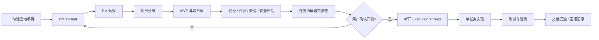
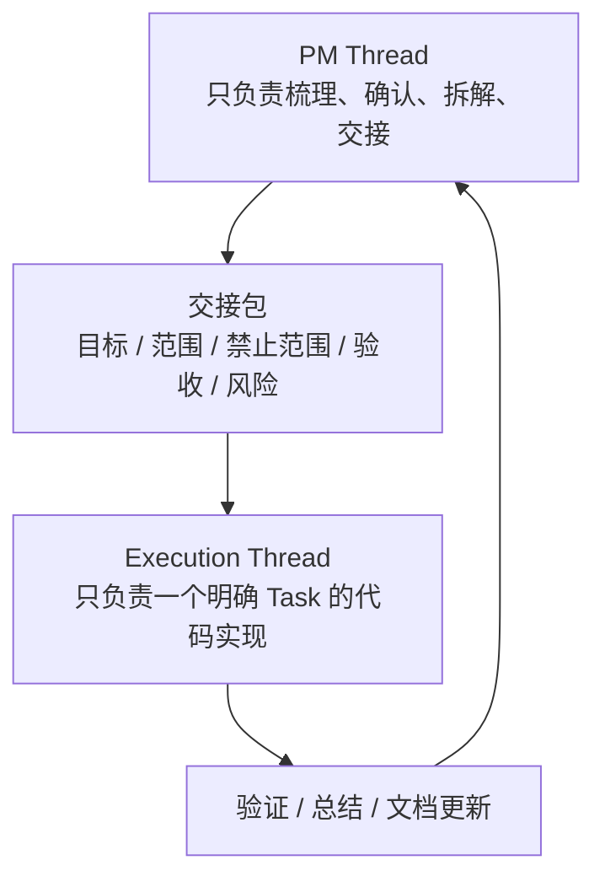

# 橙影 · Codex 企业级工作流 Skill Pack

这是一个让 Codex 按真实软件开发流程启动、梳理、拆解和执行项目的技能包。

它的核心目标是：用户用一句话提出项目想法后，Codex 先作为 PM Thread 完成需求访谈、范围确认、风险评估和任务交接；只有用户确认进入开发后，才切换到新的 Execution Thread 修改代码。

## 适用项目

- 简单网站、官网、活动页
- 小程序
- App
- SaaS 项目
- 后台管理系统
- 企业内部系统
- 工具软件
- 长期商业项目
- 基于开源项目二开

## 工作流



## 线程职责



PM Thread 不写代码，不初始化框架，不创建源码目录。Execution Thread 必须基于 PM Thread 的交接包执行。

## 快速使用

安装 skill 后，对 Codex 说：

```text
启动橙影 Codex 企业级工作流，先 PM 访谈，不要直接开发。
```

也可以用更自然的一句话：

```text
用橙影工作流帮我做一个会员管理小程序，先梳理需求，再决定怎么开发。
```

```text
按橙影 Codex 企业级工作流，从 0 帮我规划一个 SaaS 项目。
```

```text
这个项目要长期维护，先建立 PM 线程和项目文档，不要直接写代码。
```

## 推荐项目目录

在真实项目中，建议只提前建立项目管理文档区，不提前创建源码目录。

```text
your-project/
  AGENTS.md
  README.md
  docs/
    codex/
      PROJECT_BRIEF.md
      CODEX_QA.md
      ROADMAP.md
      TASKS.md
      DECISIONS.md
      CONTEXT.md
      SECURITY.md
      THREADS.md
      MERGE_PLAN.md
      REVIEW_CHECKLIST.md
```

规则：

- `AGENTS.md` 可以放在项目根目录，用于约束 Codex。
- 其他治理文档优先放入 `docs/codex/`，避免污染根目录。
- 已有项目不得直接覆盖 `README.md`、`CHANGELOG.md`、`AGENTS.md`。
- `src/`、`app/`、`server/`、`packages/` 等源码目录必须等技术栈确认后再创建。

## PM Thread 输出

PM Thread 应产出：

- 项目一句话说明
- 目标用户
- 核心场景
- MVP 范围
- 非目标
- 项目复杂度等级
- 技术路线建议
- 安全风险
- 第一阶段任务池
- Execution Thread 交接包

## Execution Thread 启动条件

只有满足以下条件，才能开始写代码：

- PM 访谈完成
- MVP 与非目标已确认
- 当前只执行一个明确 Task
- 修改范围和禁止修改范围已写清楚
- 验收标准已确认
- 用户明确说“开始开发”或等价指令

## 安装为 Codex Skill

将本仓库目录放入 Codex skills 目录：

```bash
~/.codex/skills/chengying-codex-skill-pack/
```

目录中必须包含：

```text
SKILL.md
README.md
AGENTS.md
```

重启 Codex 后即可使用。

## 设计原则

- 先理解，再规划，再执行。
- PM Thread 与 Execution Thread 分离。
- 默认单线程，不默认多线程。
- 长期线程服务长期主线。
- 临时线程完成后必须合并、放弃或归档。
- 不覆盖用户已有文件。
- 不修改无关模块。
- 不把 API Key 写进前端或仓库。
- 每个任务必须可验收、可回滚、可沉淀。
