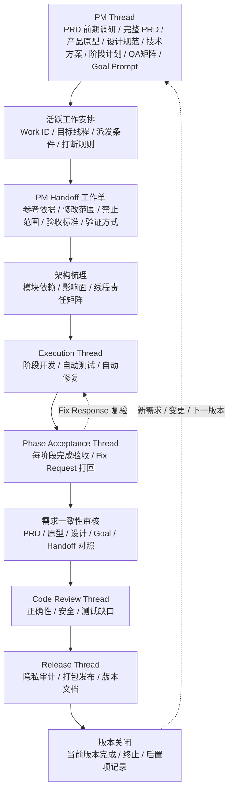
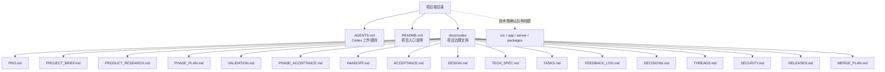

# 橙影 · Codex 企业级工作流 Skill Pack

面向 Codex 的对话式软件项目协作工作流 Skill Pack。

它适合把“开发一个 xxx 程序”的粗略想法、半成型需求，或已有 PRD / 原型 / 设计稿 / 代码仓库 / 技术方案的可执行完整需求，先通过对话交给 Codex 判断输入成熟度、流程档位和风险，再按需要完成 PM 访谈、PRD 前期竞品/同类产品方向校准、完整 PRD、产品原型/交互草图、设计规范、技术方案/ADR、架构影响面、阶段开发计划、QA 验证矩阵、开发前 Goal Prompt 和交接包整理；等用户明确确认“按这个 Goal 执行”后，再进入 Execution Thread 或当前线程的执行阶段，做受控自动开发、自动测试、自动修复。

核心原则很简单：先像真实软件团队一样把项目想清楚，再让 Codex 写代码。

## 能解决什么

- 避免 Codex 一上来就建项目、写代码、选技术栈。
- 避免 Codex 阿谀奉承或迎合式确认；有风险、矛盾或不可实现点时必须直接指出。
- 把 PM Thread 和 Execution Thread 分开，PM 线程不改代码。
- 先判断 Lean / Standard / Enterprise 流程档位，让小项目快走、正式项目完整走、长期商业项目严格走。
- 逼问出完整、可实现、可测试、可验收的 PRD。
- 新软件、产品、网站、App、小程序、SaaS、后台和内部系统默认要有产品原型或交互草图；Lean 可轻量，Standard/Enterprise 必须覆盖核心路径、页面/模块结构、关键交互和状态。
- 逼问出完整设计规范；必须询问产品原型、参考产品、截图、Figma、草图、品牌素材、现有页面或竞品 URL。
- 没有明确原型或视觉目标时，先确认是否调用 Product Design:get-context -> Product Design:ideate；brief 经用户确认后生成 3 个方向，等用户选择后才能进入实现。
- 明确 `可执行完整需求` 的判断标准：必须满足当前档位和本轮目标的全部开发前提，能完整支撑 Handoff、阶段计划、Goal Prompt、验证和回滚；资料完整仍不等于执行授权。
- 标准项目在 PRD 冻结前轻量查竞品、同类产品和开源方案；长期商业项目在 PRD 冻结前评估竞品边界和可商用开源二开底座，用来指导 PM 判断和缩短开发周期，但不默认采用。
- 涉及核心技术选型、API、数据、权限、部署或新增依赖时，先写一页 `TECH_SPEC.md` 或 ADR，避免边做边改架构。
- 让正式开发前必须明确 Goal Prompt、执行授权、MVP、非目标、阶段计划、验证方案、验收标准、修改范围和禁止修改范围；只发需求、PRD 或让整理 Goal 不等于授权执行。
- PM 派发给任何线程前必须先登记活跃工作安排，生成 Work ID；Execution / Acceptance / Review / Release 线程都以 Work ID + Handoff 工作单为依据。
- 用户暂不确认或不选择使用 Goal 时，不进入 Execution Thread，但 PM Thread 继续按阶段开发计划沟通缺口、风险、建议和下一步选择。
- 已派发工作在执行线程未产生代码修改前可以调整；进入执行后，除阻塞、范围冲突、安全风险或用户强制变更外，不得随意打断。
- Phase Acceptance 通过后，必须从活跃工作安排中移除该 Work ID，并把摘要归档到 QA/验收/完成记录，避免活跃上下文堆积。
- 用全流程门禁表检查每个阶段能否进入下一阶段，避免流程“看起来走了、实际没闭环”。
- 在多线程分工前先做架构梳理和影响面分析，避免一个线程改完牵连其他模块。
- 支持受控自动开发：确认 Goal 和自动化模式后，按阶段自动开发、自动测试、自动修复，失败时停止并说明阻塞。
- 项目没有测试脚本时，先生成 `VALIDATION.md` 和 QA 验证矩阵；没有验证方式不得自动开发。
- UI 验收、localhost 页面检查和截图默认使用 Codex 内置浏览器；只有需要 Chrome 登录态、Cookie、插件、已打开页面状态或用户明确要求时，才使用外置 Chrome。
- 每轮/每阶段完成后进入独立 Phase Acceptance Thread，不合格直接打回执行线程。
- 审查或验收不通过时生成 Fix Request，Execution Thread 按打回包定向修复并输出 Fix Response，最多自动修复 3 轮。
- 全部阶段验收通过后，再做需求一致性审核，确认严格符合 PRD、产品原型、设计规范、Goal、阶段计划和 Handoff。
- 加入隐私审计、打包发布、版本文档、独立代码审查线程和自进化记录。
- 用户反馈问题时先记录到 `FEEDBACK_LOG.md`；重复、高影响或导致返工的问题升级为检查项、决策或项目硬规则。
- 适配轻量 Demo、正式产品、长期商业项目三种复杂度。
- 为长期项目沉淀 `docs/codex/` 文档，降低聊天上下文丢失带来的风险。
- 规范多线程开发：长期线程服务长期主线，临时线程完成后必须合并、放弃或归档。

## 适用项目

- 小程序、H5、官网、活动页
- Web App、SaaS、后台管理系统
- iOS / Android / 跨端 App
- 企业内部系统、CRM、订单系统、内容系统
- 工具软件、AI 工具、自动化工具
- 基于开源项目的二次开发
- 需要长期维护、多人协作、阶段性交付的商业项目

## 工作流总览

```mermaid
flowchart LR
  A[项目想法 / 半成型需求 / 完整材料] --> Intake[输入成熟度判断]
  Intake --> B[PM Thread]
  B --> Mode[项目等级 / 流程档位]
  Mode --> Research[PRD 前期竞品 / 同类产品方向校准]
  Research --> C[完整 PRD]
  C --> D[产品原型 / 设计规范]
  D --> Gate1{门禁通过?}
  Gate1 -- 否 --> B
  Gate1 -- 是 --> E[技术方案 / 架构影响面]
  E --> F[阶段计划 / QA 验证矩阵]
  F --> G[Goal Prompt / 等待执行授权]
  G --> W[明确确认后登记 Work ID / PM Handoff 工作单]
  W --> Gate2{门禁通过?}
  Gate2 -- 否 --> B
  Gate2 -- 是 --> I[Execution Thread / 当前线程执行阶段]
  I --> J[自动开发 / 自动测试 / 自动修复]
  J --> L[Phase Acceptance Thread]
  L -- needs-fix / Fix Request --> I
  L -- 通过且还有下一阶段 --> I
  L -- 全部阶段通过 --> M[需求一致性审核]
  M --> N[Code Review Thread]
  N --> O[隐私审计 / 打包发布 / 版本文档]
  O --> P[版本关闭]
  P --> Evolution[反馈记录 / 文档进化]
  Q["用户反馈 / 重复问题"] -. 任何阶段 .-> Evolution
  Evolution -. 新需求 / 变更 / 下一版本 .-> B
```



## 流程档位

项目等级判断复杂度，流程档位决定本次流程重量。

| 档位 | 适用 | 特点 |
| --- | --- | --- |
| Lean | 小工具、Demo、单页、小改动 | 1 到 2 轮 PM，轻量 Handoff，竞品调研可跳过，轻量验收 |
| Standard | 正式小程序、网站、App、后台、中小型 SaaS | 完整 PRD、产品原型、设计规范、轻量调研、阶段计划、验证方案、一段式 Goal 指令和阶段验收 |
| Enterprise | 长期商业项目、用户数据、权限、上传、计费、发布、多线程 | 完整文档体系、技术方案/ADR、架构影响面、多线程治理、需求一致性审核、Code Review、隐私审计和发布文档 |

默认映射：Level 1 -> Lean，Level 2 -> Standard，Level 3 -> Enterprise。涉及登录、权限、上传、支付、客户数据、schema/API、发布或商用交付时必须升级流程档位。

## 线程职责图



PM Thread 只负责梳理、判断、确认、登记和交接，不负责代码修改。真正开始开发时，应先登记 Work ID，再优先新开 Execution Thread；如果环境没有线程工具，可在当前线程显式切换到执行阶段，并把 PM Handoff 工作单、架构影响面和线程责任矩阵作为执行输入。

## 安装

推荐安装到 Codex skills 目录：

```bash
mkdir -p ~/.codex/skills
git clone https://github.com/btcys/chengying-codex-skill-pack.git ~/.codex/skills/chengying-codex-enterprise-skill
```

目录中必须包含：

```text
SKILL.md
AGENTS.md
README.md
references/
assets/templates/
```

安装后重启 Codex，或开启一个新的 Codex 对话，让 Skill 列表重新加载。

`SKILL.md` 是 Codex 触发后的入口规则；`references/` 是按需加载的细则库；`assets/templates/` 存放真实项目可复制的 `docs/codex/` 模板。PM 访谈、完整 PRD、产品原型、设计规范、架构多线程、文档治理、执行回滚、发布审计分别拆在不同文件里，这样日常调用更轻，遇到长期项目或多线程项目时又能加载完整规则。

如果你已经下载了 zip，也可以把解压后的文件夹放到：

```text
~/.codex/skills/chengying-codex-enterprise-skill/
```

## 更新

如果是用 `git clone` 安装的：

```bash
cd ~/.codex/skills/chengying-codex-enterprise-skill
git pull
```

如果是手动复制安装的，用新版本覆盖同名目录即可。覆盖前建议保留自己改过的 `SKILL.md` 或 `AGENTS.md`。

## 快速开始

安装后，对 Codex 说：

```text
启动橙影 Codex 企业级工作流，先 PM 访谈，不要直接开发。
```

如果你的 Codex 支持显式 Skill 调用，也可以这样写：

```text
Use $chengying-codex-enterprise-skill，先作为 PM Thread 梳理项目，不要直接写代码。
```

也可以直接描述项目：

```text
用橙影工作流帮我做一个会员管理小程序，先梳理需求，再决定怎么开发。
```

```text
按橙影 Codex 企业级工作流，从 0 规划一个 SaaS 项目，先输出 PM 交接包。
```

```text
这个项目准备长期维护，先建立 PM 线程、项目文档和任务拆解，不要直接写代码。
```

## 推荐使用方式

### 1. 先开 PM Thread

在 PM Thread 里，让 Codex 做需求访谈和范围确认：

```text
启动橙影 Codex 企业级工作流。
这是一个面向门店的会员管理小程序，请先作为 PM Thread 访谈我，不要写代码。
```

PM Thread 会逐步逼问并确认：

- 项目目标、用户、核心场景
- 项目类型和复杂度等级
- Lean / Standard / Enterprise 流程档位和选择理由
- PRD 冻结前的竞品、同类产品、开源方案或可商用二开底座调研结论
- 完整 PRD
- MVP 必做功能和非目标
- 产品原型或交互草图；不确定时给方案选择
- 完整设计规范；不确定时给方案选择
- 参考产品、截图、Figma、原型、草图、品牌素材、现有页面或竞品 URL
- Product Design brief、是否生成 3 个视觉方向、用户选定方向或明确跳过原因
- 是否调用 Product Design / ui-ux-design-advisor / motion-quality / better-icons / ImageGen / Figma / UI 审查类 Skill，以及调用结论
- 是否已有代码、设计稿、接口、数据库或服务器
- UI/UX 参考方向
- 调研结论对 PRD、MVP、非目标、设计规范和技术路线的影响
- 技术路线、风险点、验收标准
- 技术方案 / ADR 是否需要及结论
- 技术方案 / ADR 结论
- QA 验证矩阵
- 一段式 Goal 授权和阶段开发计划
- 活跃工作安排、Work ID、目标线程和派发条件

### 2. 让 PM Thread 输出交接包

当需求清楚后，对 Codex 说：

```text
请整理 PM Handoff 工作单，包括 Work ID、目标线程、派发条件、完整 PRD、产品原型/交互草图结论、设计规范、一段式 Goal 授权、阶段开发计划、MVP、非目标、技术路线、当前 Task、修改范围、禁止修改范围、架构影响面、风险点、验证方式和验收标准。
```

交接包应至少包含：

- 项目一句话说明
- 当前阶段目标
- 完整 PRD
- 产品原型/交互草图结论或无需生成原因
- 完整设计规范
- Work ID、目标线程和活跃工作安排状态
- 一段式 Goal 授权和用户确认结果
- 阶段开发计划
- MVP 范围
- 非目标清单
- 推荐技术路线
- 第一阶段任务池
- 当前 Task 的目标与边界
- 准备修改的文件范围
- 禁止修改的范围
- 架构影响面
- 上下游依赖
- 验收标准
- 风险点与回滚方式

### 3. 再开 Execution Thread

用户确认后，再在新的执行线程里输入：

```text
当前已切换到 Execution Thread。
请严格基于下面 Work ID 和 PM Handoff 工作单执行，只做当前 Task，不做无关优化。

[粘贴 PM Handoff 工作单]
```

Execution Thread 的职责是实现一个明确任务，并在结束时输出：

- 修改文件列表
- 完成内容
- 测试结果
- 自动修复轮次
- 风险点
- 未完成事项
- 下一步建议

### 4. 选择自动化模式

这个 Skill 支持的是受控自动开发，不是无边界无人值守开发。

推荐默认使用：

```text
自动化模式使用 Assisted Autopilot：在当前阶段内自动开发、测试、修复；阶段完成后停到 Phase Acceptance Thread，不要自我验收。
```

高风险任务使用：

```text
自动化模式使用 Manual：涉及 schema、权限、支付、上传、发布或新增依赖时，每一步先确认。
```

低风险且边界清楚时才使用：

```text
自动化模式使用 Long-run Autopilot：可以连续执行多个已确认阶段，但每阶段都必须经过 Phase Acceptance Thread，不合格立即打回。
```

如果项目没有测试脚本，先建立替代验证方案：

```text
请先识别当前项目可用测试命令；如果没有测试脚本，生成 VALIDATION.md，列出当前阶段可执行的替代验证清单。没有验证方式不要进入自动开发。
```

### 5. 长期项目持续沉淀

长期项目建议把决策和上下文写入 `docs/codex/`，后续每次任务都先读取这些文档，再进入执行。

## 推荐项目目录

在真实项目中，PM 阶段只建议提前建立项目管理文档区，不提前创建源码目录。

文档按流程档位启用：Lean 只保留必要文档；Standard 使用核心 `docs/codex/` 文档；Enterprise 再增加线程、审计、发布、上下文和决策文档。不要一开始把所有模板都创建出来。

```text
your-project/
  AGENTS.md
  README.md
  docs/
    codex/
      PRD.md
      PROJECT_BRIEF.md
      PRODUCT_RESEARCH.md
      PHASE_PLAN.md
      VALIDATION.md
      PHASE_ACCEPTANCE.md
      HANDOFF.md
      ACCEPTANCE.md
      DESIGN.md
      TECH_SPEC.md
      VISUAL_REFERENCES.md
      CODEX_QA.md
      ROADMAP.md
      TASKS.md
      FEEDBACK_LOG.md
      DECISIONS.md
      CONTEXT.md
      SECURITY.md
      THREADS.md
      MERGE_PLAN.md
      REVIEW_CHECKLIST.md
      PRIVACY_AUDIT.md
      RELEASES.md
```

规则：

- `AGENTS.md` 可以放在项目根目录，用于约束 Codex。
- 其他治理文档优先放入 `docs/codex/`，避免污染根目录。
- 已有项目不得直接覆盖 `README.md`、`CHANGELOG.md`、`AGENTS.md`。
- `src/`、`app/`、`server/`、`packages/` 等源码目录必须等技术栈确认后再创建。

## 项目目录策略



## 多线程规则

- 默认单线程，不默认多线程。
- 多线程只在项目复杂度、模块边界、数据模型、架构影响面和合并策略足够清晰时启用。
- 长期线程优先服务长期主线，例如核心架构、稳定业务模块、数据模型。
- 临时线程只用于 hotfix、实验、技术 spike 等短周期任务。
- 多线程前必须先输出模块清单、依赖关系、共享资源、影响面表和线程责任矩阵。
- 公共组件、数据模型、API 契约、权限模型、状态管理和构建配置不能被多个线程同时修改。
- 如果一个线程的修改会影响其他线程输入输出，必须回到 PM Thread 重新确认。
- 临时线程完成后必须进入“合并、放弃或归档”流程。
- 涉及多线程时必须更新 `THREADS.md` 和 `MERGE_PLAN.md`。

## 架构梳理输出

在正式拆线程前，Codex 应先输出：

- 模块清单：每个模块的职责、输入、输出和 owner。
- 依赖关系：当前模块依赖谁，以及谁依赖当前模块。
- 共享资源：公共组件、hooks、store、API client、schema、配置、权限、上传、缓存等。
- 影响面表：本次任务可能影响的页面、接口、数据结构、权限、构建和测试。
- 线程责任矩阵：每个线程允许修改范围、禁止修改范围、需要同步的上下游。
- 合并顺序：先合基础设施、数据模型、公共契约，再合业务功能和 UI。
- 验证矩阵：每个线程完成后必须验证哪些跨模块主链路。

## 典型调用模板

PM 启动：

```text
启动橙影 Codex 企业级工作流。请作为 PM Thread，逼问出完整 PRD 和设计规范；信息不确定时给方案让我选择，不要写代码。
```

流程档位：

```text
请先判断项目等级和 Lean / Standard / Enterprise 流程档位。小项目不要默认走企业级流程；涉及登录、权限、上传、支付、客户数据、发布或商用交付时必须升级流程。
```

产品原型 / 设计规范 / Product Design：

```text
请在产品原型与设计规范阶段先问我有没有产品原型、流程草图、参考产品、截图、Figma、品牌素材、现有页面或竞品 URL；如果没有明确原型或视觉目标，请确认是否调用 Product Design:get-context 建立 brief，brief 经我确认后再用 Product Design:ideate 给 3 个方向；不要进入 image-to-code，直到我选定产品原型/视觉方向，并明确授权按 Goal Prompt 执行。
```

同类产品 / 开源方案：

```text
请在 PRD 冻结前按项目等级做竞品、同类产品与开源方案调研：Level 2 轻量查 2 到 3 个同类产品和 1 到 3 个开源/模板/组件候选；Level 3 评估竞品功能边界和可商用开源二开底座，输出 License、维护状态、二开成本、架构绑定风险、adopt/reference/avoid 结论，以及对 PRD、MVP、非目标、设计规范和技术路线的影响。
```

Goal Prompt 与执行授权：

```text
请基于已确认的 PRD、产品原型/交互草图、设计规范、技术方案/ADR、架构影响面、阶段开发计划、QA 验证矩阵和自动化模式，写出一段正式开发前 Goal Prompt，方便我确认或复制给 Codex 设置目标。只输出 Goal Prompt 不代表开始执行；必须等我明确说“按这个 Goal 执行 / 开始开发 / 进入 Execution”后，才登记 Work ID、生成 PM Handoff 并进入执行。如果我暂不确认，请继续按阶段开发计划给我缺口、建议和下一步选择。
```

全流程对齐：

```text
请按橙影工作流对齐全部流程，输出每个阶段的当前状态、已有产物、缺口和下一步；门禁不通过的阶段不要继续推进。
```

已有项目梳理：

```text
按橙影工作流审视这个已有项目。先读取 README / AGENTS / docs/codex，再判断当前阶段、风险和下一步任务，不要直接改代码。
```

准备开发：

```text
请先登记活跃工作安排并生成 Work ID，然后基于已确认的 PM Handoff 工作单，帮我生成一个适合新 Execution Thread 使用的任务说明。
```

执行线程：

```text
当前是 Execution Thread。请基于 Work ID 和 PM Handoff 工作单执行当前阶段，自动开发、自动测试、自动修复；修改范围外的文件不要碰，完成后给出测试结果、自动修复轮次、风险、回滚方式和 Work ID 状态建议。
```

受控自动开发：

```text
请按 Assisted Autopilot 执行当前阶段：自动开发、自动测试、自动修复，最多修复 3 轮；阶段完成后停到 Phase Acceptance Thread。
```

验证方案：

```text
请为当前阶段生成 VALIDATION.md：先列出可运行的测试命令；如果没有测试脚本，就给出可执行的替代验证清单、QA 验证矩阵和阻塞项。UI 验收和截图默认使用内置浏览器，只有需要 Chrome 登录态、Cookie、插件或我明确要求时才使用外置 Chrome。
```

技术方案 / ADR：

```text
请判断当前任务是否需要 TECH_SPEC.md 或 ADR。涉及核心技术选型、API、数据模型、权限、上传、支付、部署、新增依赖或长期维护时，先写一页技术方案再进入 Execution Thread。
```

阶段验收线程：

```text
当前是 Phase Acceptance Thread。请只验收当前 Work ID 是否严格完成 PHASE_PLAN 里的计划项，对照 Handoff、测试结果和修改文件；不合格生成 Fix Request 打回 Execution Thread，不要替它修代码；通过后要求从活跃工作安排移除并归档摘要。
```

打回修复：

```text
当前是 Execution Thread。请只根据 Phase Acceptance / Requirement Compliance / Code Review 的 Fix Request 定向修复，不新增需求、不扩大范围；修复后输出 Fix Response、重新运行验证，并提交回对应验收线程。
```

需求一致性审核：

```text
请按橙影工作流做需求一致性审核，逐条对照 PRD、产品原型、设计规范、Goal、阶段计划和 Handoff，检查是否漏做、错做、多做或越界修改。未通过不要进入 Code Review。
```

多线程治理：

```text
按橙影工作流检查当前任务是否适合多线程。如果适合，请先做架构梳理，输出模块依赖、影响面表、线程责任矩阵，再区分长期线程和临时线程，并给出合并、归档和回滚策略。
```

发布审计：

```text
请按橙影工作流进入 Release Thread，做隐私审计、打包发布检查、版本文档和回滚方案，不要新增业务功能。
```

反馈进化：

```text
用户反馈了一个流程/执行问题：请先记录到 FEEDBACK_LOG.md；如果这是重复问题或导致返工，请判断应该升级到 REVIEW_CHECKLIST.md、DECISIONS.md、CONTEXT.md、AGENTS.md 还是对应专题文档，并说明后续如何检查。
```

## 设计原则

- 先理解，再规划，再执行。
- 客观协作，不阿谀奉承，不用顺耳的话代替判断。
- 发现风险、矛盾、不可实现或验收不清时，必须直接指出并给替代方案。
- 每个阶段进入下一阶段前必须检查门禁状态。
- 先判断 Lean / Standard / Enterprise 流程档位；小项目压缩流程，风险项目升级流程。
- PM Thread 与 Execution Thread 分离。
- PM Thread 不写代码，不初始化框架，不创建源码目录；必须产出完整 PRD、产品原型/交互草图、设计规范、阶段开发计划、验证方案，并在正式开发前输出 Goal Prompt，等待用户明确执行授权。
- 产品原型与设计规范阶段必须判断 Product Design、ui-ux-design-advisor、motion-quality、better-icons、ImageGen、Figma 和审查类 Skill 的调用；实现型 image-to-code、图标同步和动画代码必须等到 Execution Thread。
- 新软件/产品/网站/App/小程序/SaaS/后台没有产品原型、流程草图、参考图、截图、Figma 或已选方向时，不得进入实现；必须继续追问、调用 Product Design 生成方向，或明确把原型/界面实现后置。
- 涉及核心技术选型、API、数据、权限、部署或新增依赖时，必须先确认技术方案 / ADR。
- Level 2 标准项目必须在 PRD 冻结前轻量查竞品、同类产品和开源方案；Level 3 长期商业项目必须在 PRD 冻结前评估竞品边界和可商用开源二开底座；任何开源方案都不能默认采用。
- 多线程前先做架构梳理和影响面分析。
- Execution Thread 可做受控自动开发、自动测试、自动修复，但不能越过门禁。
- 没有测试脚本时必须先生成 `VALIDATION.md` 替代验证方案和 QA 验证矩阵。
- 每轮/每阶段完成后必须进入独立 Phase Acceptance Thread，不合格打回。
- 打回必须有 Fix Request；修复必须有 Fix Response；同一问题最多自动修复 3 轮。
- Code Review 前必须先做需求一致性审核。
- 复杂项目必须有独立 Code Review Thread。
- 正式版本必须做隐私审计、打包发布检查和版本文档。
- 用户反馈问题必须先记录；重复、高影响或导致返工的问题必须升级到相关文档或检查项。
- 当前版本关闭后不自动回 PM，只有新需求、变更、返工或下一版本才回 PM。
- 用户不确认 Goal 或只是要求整理 Goal 时不进入执行线程；PM Thread 应继续分阶段沟通和给建议，不能把流程卡死。
- 用户确认前不选技术栈、不引入依赖、不做大重构。
- 每个开发任务必须可验收、可回滚、可沉淀。
- 不覆盖用户已有文件。
- 不修改无关模块。
- 不把 API Key 写进前端或仓库。
