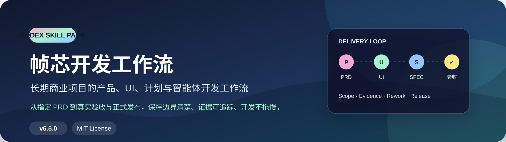
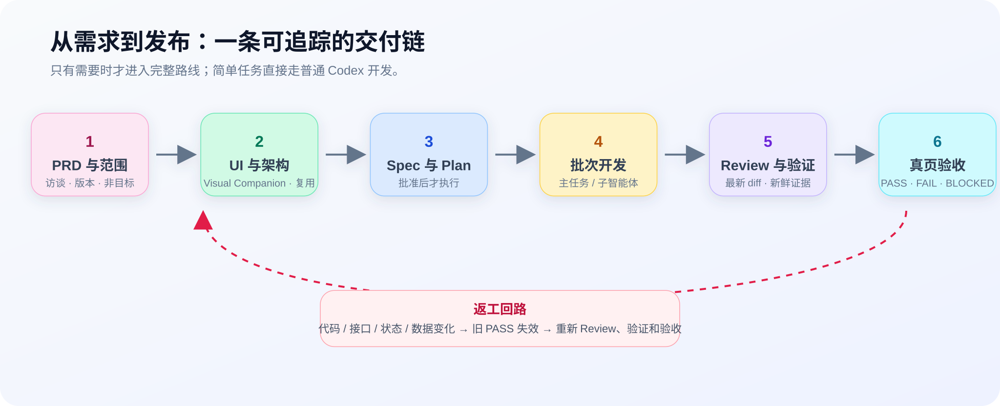
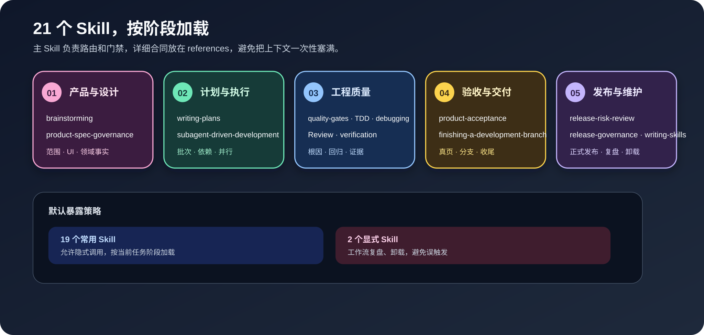

# 帧芯开发工作流 6.2

<p align="center">
  
</p>

<p align="center">
  <a href="https://github.com/btcys/chengying-codex-skill-pack"></a>
  <a href="https://github.com/btcys/chengying-codex-skill-pack/blob/main/LICENSE"></a>
  <a href="https://github.com/btcys/chengying-codex-skill-pack/tree/main/skills"></a>
  <a href="https://github.com/btcys/chengying-codex-skill-pack/tree/main/tests"></a>
</p>

帧芯开发工作流是一个面向长期、多模块商业软件项目的 Codex Skill Pack。它把产品需求、Design-Brief 设计规范、UI 设计、架构选型、版本计划、代码实现、验收和发布治理串成一条可追踪的开发链路，同时保持简单任务的开发速度。

## 解决什么问题

- 让长期项目按版本和交付单元推进，不再依赖聊天记录记忆阶段。
- 新页面或重大 UI 改动先确认真实交互，再进入实现，减少“功能完成后才返工 UI”。
- 用 Spec、Plan、Task 和证据记录明确边界，避免 AI 顺手增加未批准功能或过度工程化。
- 后续返工和补充需求默认增量合并；已批准内容按修订保留，不能用新指令覆盖旧计划。
- 让子智能体按功能批次并行开发，控制共享文件、状态、接口和 worktree 冲突。
- 在真实入口完成产品验收，并在代码再次变化时自动使旧 PASS 证据失效。
- 区分本地开发、测试环境和正式发布的授权边界：本地测试以效率为主，生产发布才严格收口。
- 按项目真实能力建立可独立运行的质量门禁，让关键规则在本地和CI持续生效。

## 核心流程



```text
指定 PRD
  → 适度需求访谈
  → 检查或建立 Design-Brief（有 UI 时）
  → 必要时架构复用调研
  → 必要时 Visual Companion UI 确认
  → Spec 批准
  → 必要时确认并建立项目质量门禁
  → Implementation Plan 与执行启动卡（数字或明确自然语言确认）
  → 子智能体按功能批次开发
  → 一次独立 Review
  → 最新完整验证
  → 真实产品验收与文档收尾
  → READY_FOR_GIT
  → 用户选择本地 commit（保存版本）、保留修改、合并或 PR（发起审核）
  → 正式发布风险审查与发布治理
```

单文件修改、确定性小 Bug、文案和样式微调不会强制走完整流程。

## Skill 组成

包内共有 21 个 Skill：



- 产品与设计：`brainstorming`、`product-spec-governance`
- 计划与执行：`writing-plans`、`executing-plans`、`subagent-driven-development`
- 并行与隔离：`dispatching-parallel-agents`、`using-git-worktrees`
- 工程质量：`project-quality-gates`、`test-driven-development`、`systematic-debugging`、`requesting-code-review`、`receiving-code-review`、`verification-before-completion`
- 验收与交付：`product-acceptance`、`finishing-a-development-branch`
- 正式发布：`release-risk-review`、`release-governance`
- 工作流维护：`writing-skills`、`optimizing-development-workflow`、`uninstall-development-workflow`

其中 19 个常用 Skill 默认允许隐式调用；工作流复盘和卸载是显式调用 Skill，避免误触发。

## 使用方式

在 Codex 中明确启动：

```text
使用帧芯开发工作流，基于我指定的 PRD 推进当前版本。
```

也可以直接调用某个阶段：

```text
$zhenxin-development-workflow:brainstorming
$zhenxin-development-workflow:writing-plans
$zhenxin-development-workflow:project-quality-gates
$zhenxin-development-workflow:subagent-driven-development
$zhenxin-development-workflow:product-acceptance
```

复盘和卸载必须明确调用：

```text
$zhenxin-development-workflow:optimizing-development-workflow
$zhenxin-development-workflow:uninstall-development-workflow
```

## 包结构

```text
.
├── .codex-plugin/plugin.json   # 插件名称、版本和界面信息
├── skills/                     # 21 个运行时 Skill
├── scripts/                    # 包校验、上下文审计、代码热点扫描
├── tests/                      # 路由场景和脚本烟测
├── NOTICE.md                   # 上游来源、许可和版本记录
├── LICENSE                     # MIT 许可
└── README.md
```

业务项目的 PRD、Spec、Plan、Task、截图和发布记录应保存在业务项目自己的 `docs/` 目录，不放入本仓库。

## 维护与验证

修改 Skill 前先检查相邻 Skill、reference、脚本和测试。完成后运行：

```bash
python3 scripts/validate-package.py
bash tests/workflow-scripts-smoke.sh
python3 scripts/audit-context.py
```

主 Skill 只保留路由、边界和关键门禁；详细模板和例外放在对应的 `references/`，避免上下文膨胀。

本次适配的场景结果与未覆盖项见 [Astra适配检查记录](tests/astra-adaptation-results.md)。

## 版本

当前版本：`6.2.0`

最后更新：`2026-09-05`

- `5.6`：PRD 唯一事实源、领域索引、变更记录和文档归档。
- `5.7`：代码或合同变化后旧 PASS 证据自动失效并重新验证。
- `5.8`：最小实现边界、本地/测试/生产执行模式、Task 继承、返工证据和完成状态统一。
- `5.9`：统一以 `Design-Brief.md` 管理项目设计规范；有 UI 的空项目先建立并确认最小设计规范。
- `6.0`：分级UI验收和按需外部参考；执行前以`1/2`确认是否启用Goal，后续需求按修订增量合并并保留旧计划。
- `6.2`：按项目能力推荐并建立项目自有质量门禁；拆分PRD项目可增加`check:product-contracts`，检查重复定义、冲突和旧版本引用。

6.2的Astra适配不增加新流程：支持自然语言确认并沿用同范围授权；有效验证证据跨回合、跨代理复用；返工根据证据进展继续或停止，不按固定次数机械卡住。TDD、UI先确认、真实验收和已批准计划保护保持不变。

运行时Goal在`READY_FOR_GIT`结束。AI报告“可以提交”只是状态，不是Git授权；没有用户针对对应动作的明确授权，不会暂存、提交、合并或推送。数字选项和明确自然语言均可授权，已有且仍适用的授权不重复询问。

## 来源与许可

通用开发方法基于 MIT 许可的 [obra/superpowers](https://github.com/obra/superpowers)，并参考 [oil-oil/oil-frontend](https://github.com/oil-oil/oil-frontend) 的前端实施规则。本项目的适配范围和许可说明见 [NOTICE.md](NOTICE.md)。
